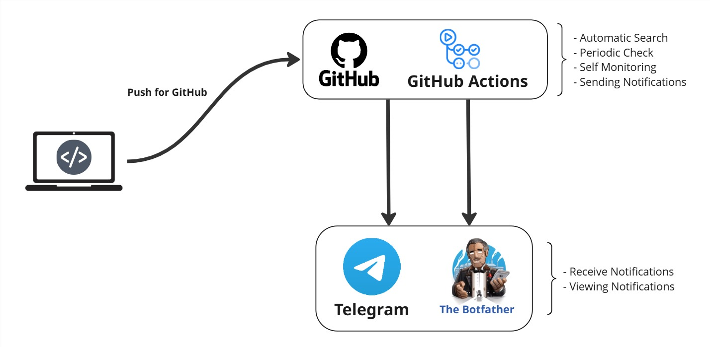

<h1 align="center">Steam Web Scraping </h1>

<p align="center">
    
    
    
    <br>
    <a href="https://share.streamlit.io/user/pedroryandatadev"></a>
    <a href="https://www.figma.com/@pedroryandev"></a>
    <a href="https://github.com/pedroryandatadev"></a>   
</p>

This web scraping project consists of an automatic Steam price monitor. It acts as a true sentinel, periodically checking if games of interest reach a predefined price or percentage discount and sending a notification via Telegram as soon as an offer is indicated.

The script integrates the Steam API with the Telegram API, fully automating the search for promotions. Monitoring is not limited to the base version of games, but also intelligently covers special editions such as Deluxe, Ultimate, and others. In addition, the project includes the selection of bundles that combine two or more different games into a single purchase.

The project runs periodically through continuous integration (CI) using GitHub Actions, a CI/CD platform integrated with GitHub that allows automating software development workflows directly in the repository.

Promotions notified are recorded in a history in JSON format, preventing the sending of duplicate notifications for the same offer. This file is automatically deleted at the beginning of each month, preventing conflicts if the same promotion occurs again in the following month, and recreated from scratch whenever necessary.

> [!IMPORTANT]
> The project does not conduct consultations via Telegram; it is used as a cross-platform interface for receiving notifications only.

<p align="center">
  
</p>

## Features

- ***Automatic Search:*** Queries the official Steam API to obtain updated prices.

- ***Edition Filter:*** Automatically monitors Deluxe, Gold, Ultimate, etc. versions.

- ***Multi-target monitoring:*** Allows you to set goals based on the final price (e.g., $ 150.00) or the percentage discount (e.g., 50% OFF).

- ***App and Subtitle Support:*** Differentiates between individual games (apps) and packages or collections (sub), ensuring that the generated link is correct.

- ***Smart Alerts:*** Notifies you via Telegram only when price or discount targets are met.

- ***History System (Anti-Spam):*** Uses a JSON file (price_history.json) to record previously sent alerts, preventing the repeated sending of the same notification while the price remains unchanged. The history is automatically reset at the beginning of each month, preventing conflicts if the same promotion occurs again the following month.

# API Steam

The project uses the __Steam API__ to retrieve data through a RESTful architecture. The collected information includes the game __title__, __price__, and __discount percentage__.

Data retrieval is performed using the individual product ID key, which is classified by type: `app`, referring to individual games, and `sub`, referring to bundles that contain two or more games. One way to identify a product’s ID is by accessing [Steam Database](https://steamdb.info), where you can search for the desired item, obtain its corresponding ID, and verify whether it belongs to the `app` or `sub` type.

The official API documentation can be found both through the [Steam Community](https://steamcommunity.com/dev) and directly on the [Valve Developer Portal](https://developer.valvesoftware.com/wiki/Steam_Web_API#Interfaces_and_method).

Product prices may vary depending on the configured region and currency. To handle this, the project uses specific variables that help identify regions through the `cc` (country code) and `l` (language) parameters. Some regional identifiers are listed below; if your region is not included, it is recommended to consult the official API documentation to obtain the corresponding codes.

```
# Change to your country

CONFIG_COUNTRY = {
    "country": "BR", # country code (cc) for localized pricing
    "lang": "pt-BR" # Language code (l) for localized responses 
}
```

## Regional Parameters (API Steam)
To change the search region, use the codes below in the `cc` and `l` parameters of your request URL:

| Country            | Code cc | Code l (Lang) | Coin  | Symbol |
|-----------------|-----------|-------------------|--------|---------|
| Brazil          | BR        | pt-BR         | Real (BRL)   | R$      |
| United States  | US        | en-US           | Dólar (USD)  | $       |
| United Kingdom     | GB        | en-GB           | Libra (GBP)  | £       |
| Italy          | IT        | it-IT           | Euro (EUR)   | €       |
| Germany        | DE        | de-DE            | Euro (EUR)   | €       |
| Spain         | ES        | es-ES           | Euro (EUR)   | €       |
| Japan           | JP        | ja-JP          | Iene (JPY)   | ¥       |
| South Korea   | KR        | ko-KR           | Won (KRW)    | ₩       |

# Architecture

<p align="center">
  
</p>

The project adopts a simple integration architecture between two platforms: __GitHub Actions__ and __Telegram__, using __BotFather__ for bot creation and management.

Through __GitHub Actions__, an innovative __CI/CD__ logic ensures the project's periodic execution, as defined in the `ci.yml` configuration file.

Telegram, in conjunction with BotFather, acts exclusively as the interface for viewing notifications of promotions defined by the project. If you are not familiar with creating bots on Telegram or generating API keys, we recommend following the official [Telegram Documentation Guide](https://core.telegram.org/bots/tutorial).

## LICENSE

```
Development in 2025 by pedroryandatadev (Pedro Ryan)

This project is licensed under the Apache 2.0 License. See the LICENSE file for more information.
```